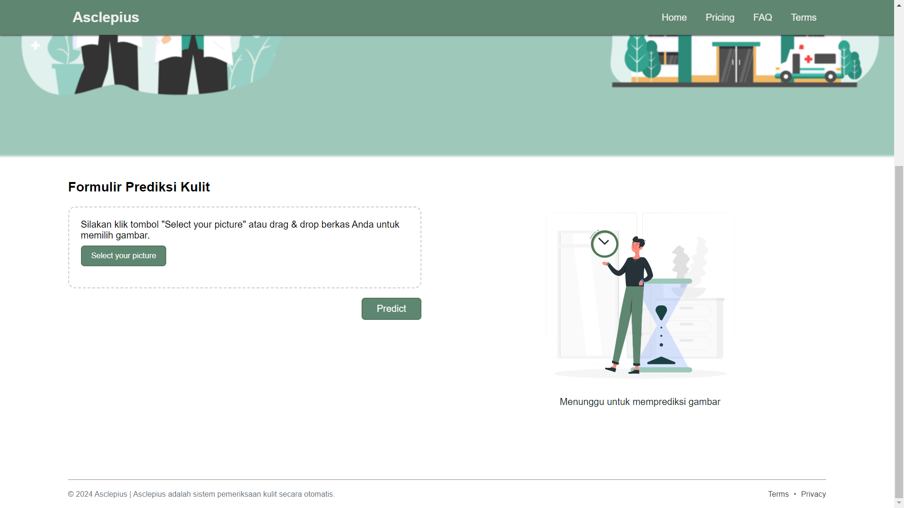

# API Documentation :
https://github.com/Frax404NF/Asclepius-dicoding-project/blob/master/docs/docs-API.md

# Landing page

# Google Cloud Services

## Cloud Run
- Deploy web-server API
- Back End

## App Engine
- Deploy Front End

## Google Cloud Storage (Bucket)
- Store ML Model

## Firestore
- Store Predict Result

